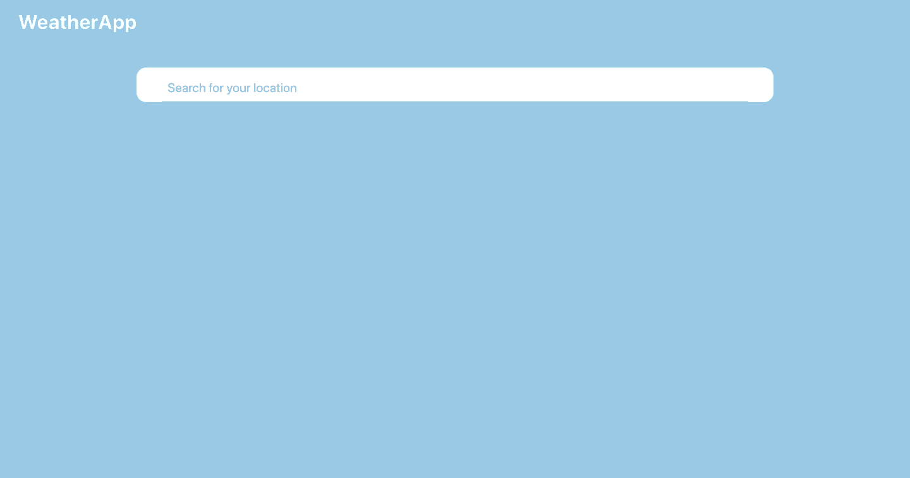

# WeatherApp Trip

## App Flow
Search, save and delete your favourite locations.

Click on a location to view its 48 hour forecast and weekly forecast. 
Scroll down to compare how this week's forecast compares to years in the past!

## APIs and Tech Stack
This project used ReactJs for the Frontend and Ruby on Rails for the Backend.

APIs used were DarkSky: Forecast and Time Machine, Google: Maps Javascript and CanvasJS.
