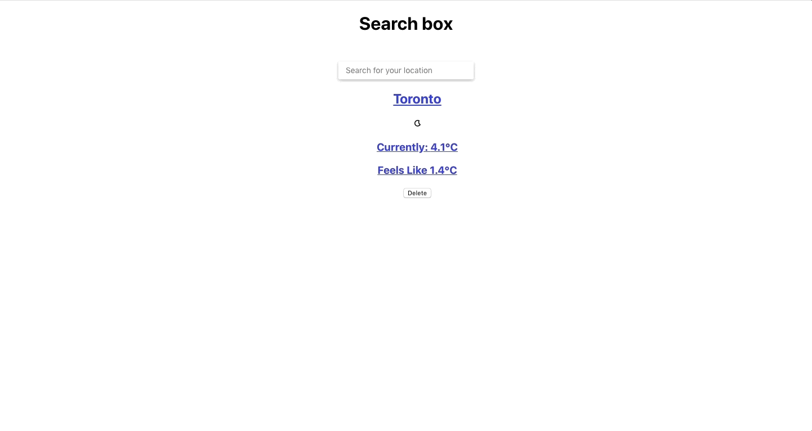

# WeatherApp Trip (Work in Progress!)

## Getting Started
First, fork this repo so you get your own copy of it. Once you have done that, you can clone your new repo to your machine, and get started.

You need **TWO** terminals for this.

In one terminal, run `bundle` to install the dependencies. Run `bin/rake db:setup` to create the databases (called rails_project_development by default). Run `bin/rails s` to run the server.

In the other terminal, `cd` into `client`. Run `npm install`. Then run `npm start` and go to `localhost:3000` in your browser.

## App Flow
Search, save and delete your favourite locations.

Click on a location to view its 48 hour forecast and weekly forecast. 
Scroll down to compare how this week's forecast compares to years in the past!

## APIs and Tech Stack
This project used ReactJs for the Frontend and Ruby on Rails for the Backend.

APIs used were DarkSky: Forecast and Time Machine, Google: Maps Javascript.
